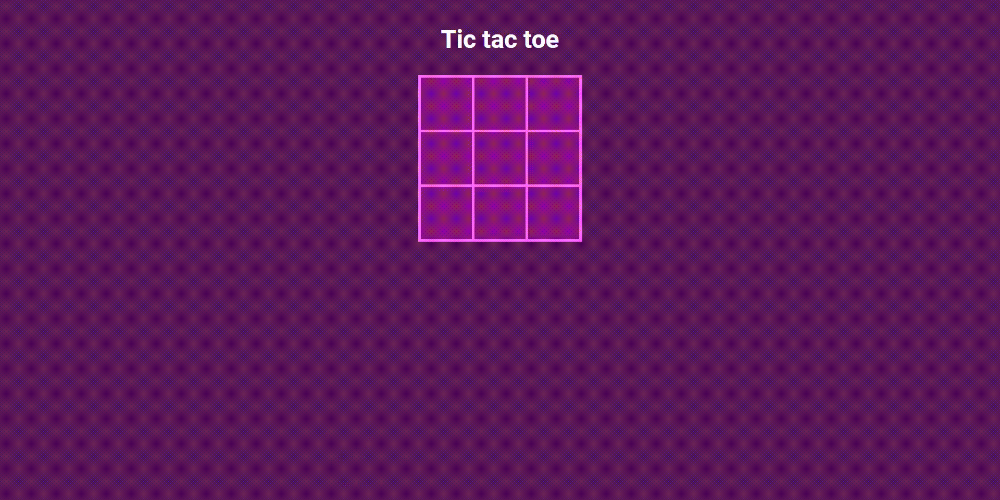

# Angular Tic tac toe

Uma aplicação de de jogo da velha em angula js.

 

## SUMÁRIO

- Status
- Deploy
- Features
- Demonstração da Aplicação
- Como Rodar a Aplicação
- Pré Requisitos Para Rodar a Aplicação
- Tecnologias utilizadas
- Autor

## Status

✨Concluído ✨

## Features

- O usuário pode clicar nos blocos para fazer sua jogada.
- A cada clique o jogador é alterado.
- Quando um jogador venver ou se der empate aparece uma mensagem.
- Quando o jogo termina aparece um botão de reload para reiniciar o jogo.
- Aplicação responsiva.

## Demonstração da Aplicação



## Pré Requisitos Para Rodar a Aplicação

Você precisa de um browser de internet (navegador) e ter o node instalado na sua máquina.

## Como Rodar a Aplicação

Primeiro, para rodar o servidor de desenvolvimento, abra a pasta do projeto no seu terminal e rodo um dos seguintes comandos:

```bash
ng serve
```

Abra em [http://localhost:4200](http://localhost:4200) para ver a resposta do servidor no navegador.

## Tecnologias Utilizadas

- [Angular](https://angular.io/docs)
- [Css3](https://developer.mozilla.org/pt-BR/docs/Web/CSS)

## Autor


Feito por Vitor Mateus

[](https://www.instagram.com/vitor_dev_/) [](https://www.linkedin.com/in/vitor-mateus-2a42461a2/)


